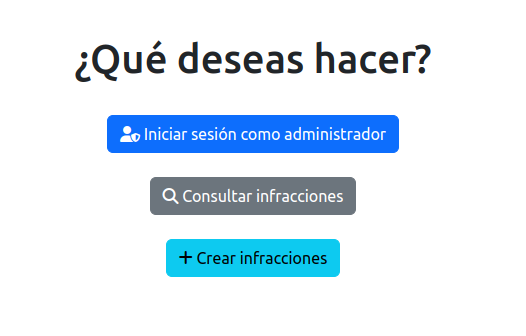
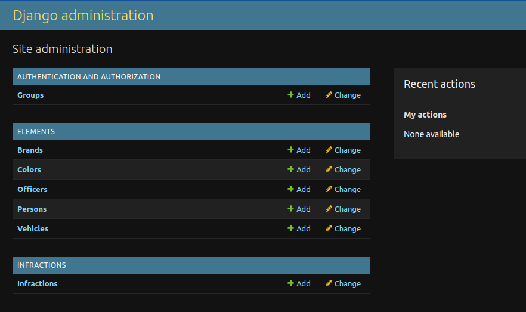

# Infractions Challenge

- [Descripción del proyecto](#descripción-del-proyecto)
- [Repositorio GitHub](https://github.com/LuisSucuc/traffic_violation)
- [Iniciar proyecto con Docker](#iniciar-challenge-con-docker)
- [Documentación del sistema](#documentación-del-sistema)
- [Supuestos](#supuestos)
- [Arquitectura en AWS](#arquitectura-en-aws)

## Descripción del Proyecto

El presente proyecto constituye la resolución del desafío de N5 Now. Este proyecto incluye un sistema básico para la administración de elementos de tránsito, como vehículos, personas, oficiales e infracciones. El sistema está desarrollado utilizando Django y Django Rest Framework, y está conectado a una base de datos PostgreSQL. Todo esto se encuentra empaquetado en contenedores Docker.

El sistema cuenta con un área administrativa, implementada mediante el administrador de Django, y un área destinada a la consulta y creación de infracciones, para la cual se desarrollaron servicios utilizando Django Rest Framework. El área de infracciones puede ser consultada a través de una interfaz gráfica creada en Django o mediante solicitudes en una colección pública de Postman

## Iniciar Challenge con Docker

### Prerequisitos

1. Docker

### Instrucciones

1. Clonar el repositorio en la carpeta deseada.
2. Crear un archivo `.env` en la raíz del proyecto con los siguientes datos. Para mayor facilidad, copiar el archivo `.env.example`. A continuación, se describen las variables de entorno:

| Variable                      | Descripción                                                                 |
|-------------------------------|-----------------------------------------------------------------------------|
| **DJANGO_DEBUG**              | Define si el modo de depuración de Django está activado (`True`) o desactivado (`False`).           |
| **DJANGO_SUPERUSER_USERNAME** | Nombre de usuario del superusuario creado automáticamente para el administrador de Django.          |
| **DJANGO_SUPERUSER_EMAIL**    | Correo electrónico del superusuario creado automáticamente para el administrador de Django.        |
| **DJANGO_SUPERUSER_PASSWORD** | Contraseña del superusuario creado automáticamente para el administrador de Django. Si se cargan los datos de prueba, se utilizará la misma contraseña para todos los usuarios.                |
| **DJANGO_SECRET**             | Clave secreta utilizada por Django para criptografía y seguridad.                                  |
| **POSTGRES_HOST**             | Dirección del host del servidor de la base de datos PostgreSQL.                                    |
| **POSTGRES_PORT**             | Puerto en el que el servidor de PostgreSQL está escuchando (por defecto, `5432`).                  |
| **POSTGRES_DB**               | Nombre de la base de datos PostgreSQL utilizada por la aplicación Django.                          |
| **POSTGRES_USER**             | Nombre de usuario para conectarse a la base de datos PostgreSQL.                                   |
| **POSTGRES_PASSWORD**         | Contraseña para el usuario de la base de datos PostgreSQL.                                         |

Ejecutar el siguiente comando:

```bash
docker-compose up -d
```

### Cargar Datos de Prueba

Para facilitar la calificación del challenge, se recomienda cargar datos de prueba. Ejecutar el siguiente comando:

```bash
docker exec n5now-api /app/sample_data/load_data.sh
```

Esto iniciará dos contenedores: uno para la base de datos y otro para la aplicación. Automáticamente se creará un superusuario con los datos del archivo `.env`. El contenedor principal estará accesible a través de <http://localhost:6565>.

### Datos de prueba creados

#### Usuarios

Automáticamente se crearán los siguientes usuarios. Todos los usuarios utilizarán la misma contraseña definida en la variable `DJANGO_SUPERUSER_PASSWORD` para simplificar la calificación del challenge.

| Username  | Email  | Password | Description |
|:------------- |:---------------:| -------------:| -------------:|
| admin         | <admin@admin.com>             | admin | Superusuario (se crea automáticamente al iniciar el proyecto)   |
| oficial1      | <oficial1@example.com>        | admin | UUsuario Oficial con permisos para reportar infracciones                    |
| oficial2      | <oficial2@example.com>        | admin | Usuario Oficial con permisos para reportar infracciones                    |

### Ejecución de pruebas unitarias

Para ejecutar las pruebas unitarias, ejecutar el siguiente comando:

```bash
docker exec n5now-api python manage.py test
```

## URL Docker Hub

[URL Docker Hub](https://hub.docker.com/r/luissucuc1/traffic_challenge)

## Documentación del sistema

### Menu principal

En el menú principal se mostrarán las siguientes opciones:



#### Iniciar Sesión como Administrador

Utilizar el nombre de usuario `admin` y la contraseña `admin`. Se mostrará el menú principal del administrador, donde se podrán administrar Marcas, Colores, Oficiales, Vehículos, Infracciones y Personas.



#### Consultar Infracciones

Se mostrará un formulario para consultar las infracciones de una persona. Ingresar el correo electrónico de la persona y se mostrarán los vehículos y las infracciones que ha cometido. Se pueden utilizar los siguientes usuarios de prueba para consultar las infracciones:

- <juan.perez@example.com>
- <maria.lopez@example.com>
- <carlos.gomez@example.com>


#### Crear Infracción

1. Iniciar sesión con el usuario `oficial1` o `oficial2` y la contraseña `admin`.
2. Se mostrará el token generado al iniciar sesión vía JWT y se activará un formulario para reportar una infracción. Ingresar la placa del vehículo, la fecha de la infracción y la descripción de la infracción. Se pueden utilizar los siguientes vehículos de prueba para reportar infracciones:
   - `IJK123`: Se reflejará en las infracciones del usuario `juan.perez@example.com`
   - `LMN456`: Se reflejará en las infracciones del usuario `maria.lopez@example.com`
   - `OPQ789`: Se reflejará en las infracciones del usuario `carlos.gomez@example.com`


### API via Postman

También se pueden testear los endpoints mediante Postman. Para ello debes realizar lo siguiente:

- Haz clic en el botón "Run in Postman" para importar la colección. Aqui encontraras datos pre-cargaos para facilitar las pruebas.

[](https://app.getpostman.com/run-collection/29726010-1cf20694-ba4d-48fd-b372-9f1f8d0c1ec1?action=collection%2Ffork&source=rip_markdown&collection-url=entityId%3D29726010-1cf20694-ba4d-48fd-b372-9f1f8d0c1ec1%26entityType%3Dcollection%26workspaceId%3Db0c20d96-0b6a-42ce-a188-1e4b26c4d788#?env%5BN5%20Challenge%5D=W3sia2V5IjoibjVfdG9rZW4iLCJ2YWx1ZSI6IiIsImVuYWJsZWQiOnRydWUsInR5cGUiOiJhbnkiLCJzZXNzaW9uVmFsdWUiOiJleUpoYkdjaU9pSklVekkxTmlJc0luUjVjQ0k2SWtwWFZDSjkuZXlKMGIydGxibDkwZVhCbElqb2lZV05qWlhOeklpd2laWGh3SWpveE56RTROVEEwTlRjM0xDSnBZWFFpT2pFM01UZzBNVGd4Tnpjc0ltcDBhU0k2SWpKaFlqTTVNemcyT1dWaS4uLiIsInNlc3Npb25JbmRleCI6MH0seyJrZXkiOiJuNV9yZWZyZXNoIiwidmFsdWUiOiIiLCJlbmFibGVkIjp0cnVlLCJ0eXBlIjoiYW55Iiwic2Vzc2lvblZhbHVlIjoiZXlKaGJHY2lPaUpJVXpJMU5pSXNJblI1Y0NJNklrcFhWQ0o5LmV5SjBiMnRsYmw5MGVYQmxJam9pWVdOalpYTnpJaXdpWlhod0lqb3hOekU0TlRBME5UYzNMQ0pwWVhRaU9qRTNNVGcwTVRneE56Y3NJbXAwYVNJNklqSmhZak01TXpnMk9XVmkuLi4iLCJzZXNzaW9uSW5kZXgiOjF9LHsia2V5IjoiYXBpIiwidmFsdWUiOiJodHRwOi8vbG9jYWxob3N0OjY1NjUvYXBpLyIsImVuYWJsZWQiOnRydWUsInR5cGUiOiJkZWZhdWx0Iiwic2Vzc2lvblZhbHVlIjoiaHR0cDovL2xvY2FsaG9zdDo2NTY1L2FwaS8iLCJzZXNzaW9uSW5kZXgiOjJ9XQ==)

- Seleciona el enviroment `N5 Challenge`, ya que se guardarán automáticamente las variables de entorno `n5_token` y `n5_refresh` al iniciar sesión.
- Inicia sesión utilizando el endpoing `Login Oficial` en la carpeta `AUTH` para obtener y generar el token.
- Realiza las pruebas necesarias.

## Supuestos

- Django es una opción suficiente y eficiente para el desarrollo de la aplicación.
- El rol de superadministrador tiene los permisos para administrar los elementos del sistema.
- El rol de Oficial Operativo tiene los permisos para reportar infracciones de tránsito.
- Es necesario pre-cargar datos para facilitar la calificación del challenge.
- Se utilizará un sistema de autenticación JWT para la autenticación de los usuarios.
- Actualmente no se tiene un dominio existente para la aplicación.
- Se dispone de suficiente presupuesto para utilizar los servicios de AWS propuestos.

## Arquitectura en AWS


### AWS Route 53

Proporciona el servicio de adquisición de dominio y servicio de DNS para dirigir el tráfico a la aplicación Django. Ofrece alta disponibilidad, escalabilidad y es sencillo de integrar con otros servicios de AWS.

### AWS Elastic Load Balancer (ELB)

Distribuye el tráfico entrante entre varias instancias de EC2 para garantizar alta disponibilidad y tolerancia a fallos. Asegura que la aplicación de Django esté disponible incluso si una instancia de EC2 falla. Escalará automáticamente las instancias de EC2 según la demanda.

### Instancia EC2

Ofrece flexibilidad y control sobre la configuración y el entorno de ejecución. Hospeda el contenedor de Docker que ejecuta la aplicación Django y es escalada por el Elastic Load Balancer según la demanda. La instancia de EC2 estará conectada a todos los servicios siguientes.

### Amazon RDS (PostgreSQL)

Proporciona una base de datos relacional gestionada para almacenar datos de la aplicación y se encarga de las tareas administrativas como configuración, copias de seguridad y actualizaciones de software, permitiendo centrarse en el desarrollo de la aplicación. El contenedor de Docker de la aplicación Django se conectará a esta base de datos.

### AWS Secrets Manager

Almacena y gestiona secretos, como credenciales de bases de datos, claves API y otros datos sensibles. Permite la conexión segura a la base de datos de Amazon RDS sin exponer las credenciales en el código fuente de la aplicación, otorgando mayor seguridad y control sobre los secretos.

### AWS CloudFront

Distribuye contenido estático desde S3 y dinámico desde EC2 con baja latencia mediante una red global de servidores edge, reduciendo la latencia y mejorando la experiencia del usuario.

### Amazon S3

Almacena y sirve archivos estáticos de Django (imágenes, CSS, JavaScript). Proporciona una forma altamente duradera y escalable de almacenar archivos estáticos generados al realizar el `collectstatic`. Se integrará con CloudFront para mejorar la entrega de contenido estático.
